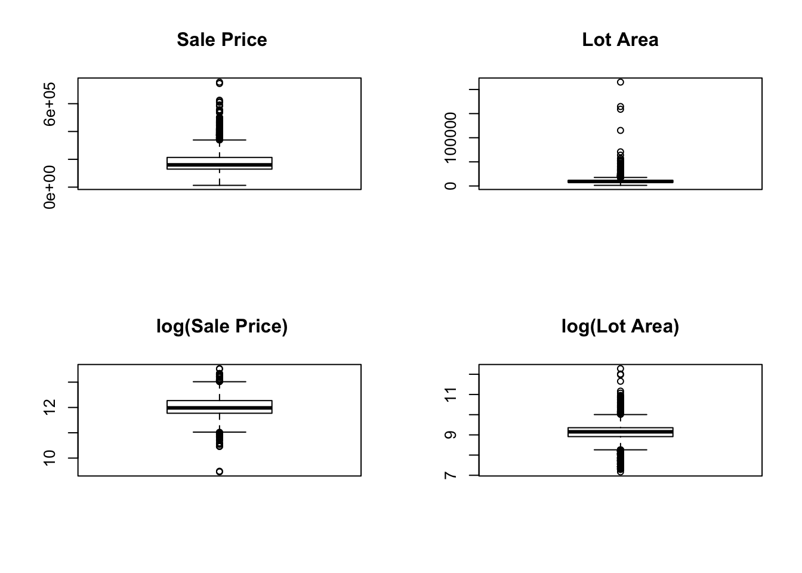
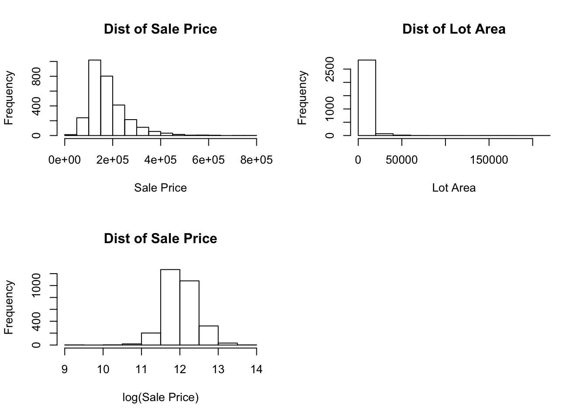
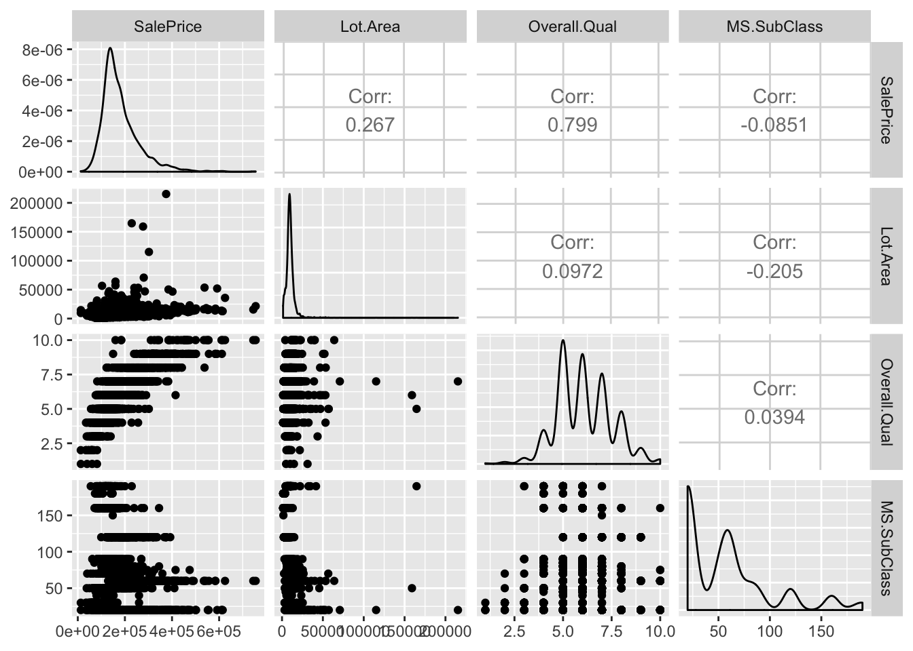

```r
data_url='/Volumes/harddisk/kiran usb_backup/Statistics 5002/AmesHousing_num.csv'
AmesHousing_num_csv=read.csv(data_url, header=TRUE)
remove(data_url)
data <- AmesHousing_num_csv
require(dplyr)
library(GGally)
```


```r
#a) probability of house having basement
houses=nrow(AmesHousing_num_csv)
houses_nb=sum(is.na(AmesHousing_num_csv['Bsmt.Qual']))
1-houses_nb/houses
## [1] 0.9730375

#b) probability of house having a pool
houses_np=sum(is.na(AmesHousing_num_csv['Pool.QC']))
1-houses_np/houses
## [1] 0.00443686

#c) probability of house having both pool and basement
poolBase=sum(is.na(AmesHousing_num_csv['Bsmt.Qual'])==FALSE & is.na(AmesHousing_num_csv['Pool.QC'])==FALSE)
poolBase/houses
## [1] 0.004095563
```

###### Question 2: Exploring linear fit models
Considering these 4 models, I will explore which of these models captures maximum variation in the y variable.
$Yij = \beta_0+\beta_1x_{1i}+\epsilon_{ij}$(1)  


$log(Yij) = \beta_0 + \beta_1x_{1i} + \epsilon_{ij}$(2)


$Yij = \beta_0 + \beta_1log(x_{1i}) + \epsilon_{ij}$(3)


$log(Yij) = \beta_0 + \beta_1log(x_{1i}) + \epsilon_{ij}$(4)


Scatter plots: 

```r
plot(AmesHousing_num_csv$Lot.Area, AmesHousing_num_csv$SalePrice, xlab = "Lot Area", ylab = "Sales Price", main = "model 1" )
```


```r

plot(AmesHousing_num_csv$Lot.Area, log(AmesHousing_num_csv$SalePrice),xlab = "Lot Area", ylab = "log(Sales Price)", main = "model 2" )
```


```r


plot(log(AmesHousing_num_csv$Lot.Area), (AmesHousing_num_csv$SalePrice),xlab = "log(Lot Area)", ylab = "Sales Price", main = "model 3")
```


```r


plot(log(AmesHousing_num_csv$Lot.Area),log(AmesHousing_num_csv$SalePrice), xlab = "log(Lot Area)", ylab = "log(Sale Price)", main = "model 4")
```


Based on just visual inspection, log(Sale Price) vs log(Lot area) shows visible linear relationship. 

We now plot boxplots to check for outliers.

```r
par(mfrow=c(2, 2))  # divide graph area in 2 columns
boxplot(AmesHousing_num_csv$SalePrice , main=" Sale Price")  

boxplot(AmesHousing_num_csv$Lot.Area, main="Lot Area") 

boxplot(log(AmesHousing_num_csv$SalePrice) , main=" log(Sale Price)")  

boxplot(log(AmesHousing_num_csv$Lot.Area), main="log(Lot Area)") 
```


Since the Sale prince and Lot Area both have several outliers, the linear regression model would not be a good model for making predictions.

Examining density plots gives an idea into normality of the variables.

```r
par(mfrow=c(2, 2)) 
hist(AmesHousing_num_csv$SalePrice, main = "Dist of Sale Price", xlab = "Sale Price")
hist(AmesHousing_num_csv$Lot.Area, main = "Dist of Lot Area", xlab = "Lot Area")

hist(log(AmesHousing_num_csv$SalePrice), main = "Dist of Sale Price", xlab = "log(Sale Price)")
```


Investigating now correlation coefficients.

```r
cor(data$Lot.Area,data$SalePrice)
## [1] 0.2665492
cor(data$Lot.Area,log(data$SalePrice))
## [1] 0.2550314
cor(log(data$Lot.Area),data$SalePrice)
## [1] 0.365076
cor(log(data$Lot.Area),log(data$SalePrice))
## [1] 0.3684939
```
As confirmed by correlation coefficients, log(sale price) and log(lot area) show maximum correlation and therefore linear dependence. The histograms also show relatively normal distributions for log(sale price) and log(lot area). This gives us some idea into which would give us a good fit.

Performing Simple Linear Regression Analysis and examining for best fit. 

```r
model1 = lm(data$SalePrice ~ 1 + data$Lot.Area)
model2 = lm(log(data$SalePrice) ~ 1 + data$Lot.Area)
model3 = lm(data$SalePrice ~ 1 + log(data$Lot.Area))
model4 = lm(log(data$SalePrice) ~ 1 + log(data$Lot.Area))
summary(model1)
## 
## Call:
## lm(formula = data$SalePrice ~ 1 + data$Lot.Area)
## 
## Residuals:
##     Min      1Q  Median      3Q     Max 
## -369375  -47827  -18982   31261  549409 
## 
## Coefficients:
##                Estimate Std. Error t value Pr(>|t|)    
## (Intercept)   1.534e+05  2.320e+03   66.11   <2e-16 ***
## data$Lot.Area 2.702e+00  1.806e-01   14.96   <2e-16 ***
## ---
## Signif. codes:  0 '***' 0.001 '**' 0.01 '*' 0.05 '.' 0.1 ' ' 1
## 
## Residual standard error: 77010 on 2928 degrees of freedom
## Multiple R-squared:  0.07105,	Adjusted R-squared:  0.07073 
## F-statistic: 223.9 on 1 and 2928 DF,  p-value: < 2.2e-16
summary(model2)
## 
## Call:
## lm(formula = log(data$SalePrice) ~ 1 + data$Lot.Area)
## 
## Residuals:
##      Min       1Q   Median       3Q      Max 
## -2.59912 -0.23301 -0.03129  0.24270  1.42795 
## 
## Coefficients:
##                Estimate Std. Error t value Pr(>|t|)    
## (Intercept)   1.189e+01  1.187e-02 1001.06   <2e-16 ***
## data$Lot.Area 1.319e-05  9.243e-07   14.27   <2e-16 ***
## ---
## Signif. codes:  0 '***' 0.001 '**' 0.01 '*' 0.05 '.' 0.1 ' ' 1
## 
## Residual standard error: 0.3942 on 2928 degrees of freedom
## Multiple R-squared:  0.06504,	Adjusted R-squared:  0.06472 
## F-statistic: 203.7 on 1 and 2928 DF,  p-value: < 2.2e-16
summary(model3)
## 
## Call:
## lm(formula = data$SalePrice ~ 1 + log(data$Lot.Area))
## 
## Residuals:
##     Min      1Q  Median      3Q     Max 
## -195967  -48146  -17408   34446  532007 
## 
## Coefficients:
##                    Estimate Std. Error t value Pr(>|t|)    
## (Intercept)         -337991      24488  -13.80   <2e-16 ***
## log(data$Lot.Area)    57058       2689   21.22   <2e-16 ***
## ---
## Signif. codes:  0 '***' 0.001 '**' 0.01 '*' 0.05 '.' 0.1 ' ' 1
## 
## Residual standard error: 74390 on 2928 degrees of freedom
## Multiple R-squared:  0.1333,	Adjusted R-squared:  0.133 
## F-statistic: 450.3 on 1 and 2928 DF,  p-value: < 2.2e-16
summary(model4)
## 
## Call:
## lm(formula = log(data$SalePrice) ~ 1 + log(data$Lot.Area))
## 
## Residuals:
##      Min       1Q   Median       3Q      Max 
## -2.68619 -0.22847 -0.02993  0.24789  1.33436 
## 
## Coefficients:
##                    Estimate Std. Error t value Pr(>|t|)    
## (Intercept)          9.3493     0.1248   74.94   <2e-16 ***
## log(data$Lot.Area)   0.2938     0.0137   21.45   <2e-16 ***
## ---
## Signif. codes:  0 '***' 0.001 '**' 0.01 '*' 0.05 '.' 0.1 ' ' 1
## 
## Residual standard error: 0.379 on 2928 degrees of freedom
## Multiple R-squared:  0.1358,	Adjusted R-squared:  0.1355 
## F-statistic: 460.1 on 1 and 2928 DF,  p-value: < 2.2e-16
```


Performing Model Diagnostics:
(a) Residuals

```r
plot(data$Lot.Area ,model1$residuals, xlab= "Lot Area", ylab = "residuals, ", main = "Residuals Model1")
abline(h=0, col= "red")
```


```r
plot(data$Lot.Area,model2$residuals, xlab= "Lot Area", ylab = "residuals, ", main = "Residuals Model 2")
abline(h=0, col= "red")
```


```r
plot(data$Lot.Area,model3$residuals, xlab= "Lot Area", ylab = "residuals, ", main = "Residuals Model 3")
abline(h=0, col= "red")
```


```r
plot(data$Lot.Area,model4$residuals, xlab= "Lot Area", ylab = "residuals, ", main = "Residuals Model 4")
abline(h=0, col= "red")
```


(b) Calculating Pearson's Sample Correlation Coefficient (r) and Coefficient of Determination (r^2)

```r
#model 1
cor(data$Lot.Area,data$SalePrice)^2
## [1] 0.07104849
#model 2
cor(data$Lot.Area,log(data$SalePrice))^2
## [1] 0.06504103
#model 3
cor(log(data$Lot.Area),data$SalePrice)^2
## [1] 0.1332805
#model 4
cor(log(data$Lot.Area),log(data$SalePrice))^2
## [1] 0.1357878
```


(c) Further we can see how the the fitted line on the scatter plots:

```r
plot(data$Lot.Area, data$SalePrice,xlab = "Lot Area", ylab = "Sales Price", main = "model 1" )
abline(model1$coefficients, col ="blue")
```


```r


plot(log(data$Lot.Area), data$SalePrice,xlab = "Lot Area", ylab = "log(Sales Price)", main = "model 2" )
abline(model2$coefficients, col ="blue")
```


```r


plot(data$Lot.Area, log(data$SalePrice),xlab = "log(Lot Area)", ylab = "Sales Price", main = "model 3" )
abline(model3$coefficients, col ="blue")
```


```r


plot(log(data$Lot.Area),log(data$SalePrice), xlab = "log(Lot Area)", ylab = "log(Sale Price)", main = "model 4")
abline(model4$coefficients, col ="blue")
```


Based on the above diagnostics, we concluded model 4 is the best fit for the given data.

######Question 2b
Given that SalePrice ($Y$) is the independent variable and Lot.Area ($x_1$), Overall.Qual ($x_2$) and MS.SubClass ($x_3$) are the dependent variables, we first try to establish the pairwise correlation between the different variables.

```r
dat2 = select(AmesHousing_num_csv, SalePrice, Lot.Area, Overall.Qual, MS.SubClass)
#round(cor(dat2),2)
#pairs(dat2)

ggpairs(dat2)
```


Correlation between x3 and all other variables are negative and very close to 0. This is because MS SubClass identifies the type of dwelling and is a nominal unordered variable. We perform a single parameter t test with null hypothesis of $\beta_3 = 0$. 

######Question2c
Question 2c (i)

```r
model=lm(log(data$SalePrice) ~ 1 + data$Lot.Area + AmesHousing_num_csv$Overall.Qual + AmesHousing_num_csv$MS.SubClass)
summary(model)
## 
## Call:
## lm(formula = log(data$SalePrice) ~ 1 + data$Lot.Area + AmesHousing_num_csv$Overall.Qual + 
##     AmesHousing_num_csv$MS.SubClass)
## 
## Residuals:
##      Min       1Q   Median       3Q      Max 
## -1.61750 -0.11961  0.01446  0.12979  0.86829 
## 
## Coefficients:
##                                    Estimate Std. Error t value Pr(>|t|)
## (Intercept)                       1.054e+01  1.895e-02 556.531  < 2e-16
## data$Lot.Area                     8.369e-06  5.226e-07  16.015  < 2e-16
## AmesHousing_num_csv$Overall.Qual  2.347e-01  2.859e-03  82.114  < 2e-16
## AmesHousing_num_csv$MS.SubClass  -6.660e-04  9.619e-05  -6.924 5.39e-12
##                                     
## (Intercept)                      ***
## data$Lot.Area                    ***
## AmesHousing_num_csv$Overall.Qual ***
## AmesHousing_num_csv$MS.SubClass  ***
## ---
## Signif. codes:  0 '***' 0.001 '**' 0.01 '*' 0.05 '.' 0.1 ' ' 1
## 
## Residual standard error: 0.2169 on 2926 degrees of freedom
## Multiple R-squared:  0.7172,	Adjusted R-squared:  0.7169 
## F-statistic:  2473 on 3 and 2926 DF,  p-value: < 2.2e-16
```
Fitted model : Sale Price = 10.543518 + ``8.3686345\times 10^{-6} Lot Area + 0.2347458 Overall Qual


```r
out=(cooks.distance(model) >= 1)
#which points
AmesHousing_num_csv$SalePrice[out=="TRUE"]
## [1] 375000
AmesHousing_num_csv$`Lot Area`[out=="TRUE"]
## NULL
AmesHousing_num_csv$`Overall Qual`[out=="TRUE"]
## NULL
#number of high leverage points
lev=lm.influence(model)$h>2*3/2930
length(AmesHousing_num_csv$SalePrice[lev="TRUE"])
## [1] 1
AmesHousing_num_csv$SalePrice[lev="TRUE"]
## [1] NA
```
Q2 (c)(iii)

```r
lot.area= 10000
qual=9
loggedSP=model$coefficients[1] + model$coefficients[2]*lot.area + model$coefficients[3]*qual
```
predicted Sale's Price = 3.4109499\times 10^{5}
