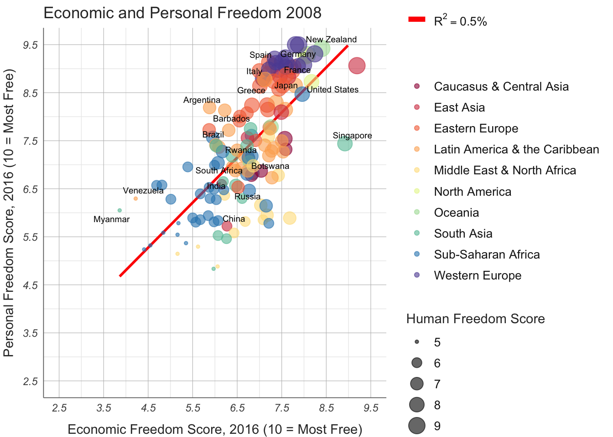
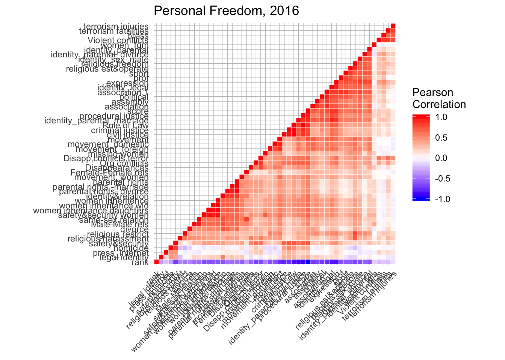

```r
library(tidyverse)
library(dplyr)
library(data.table)
library(ggrepel)
library(plotly)
```

```r
#reading in the data
hfi_cc_2018 = read.csv(file = 'hfi_cc_2018.csv')
```
# Context
Since this is my first kaggle kernel, I decided to just try out some visualisation to get started. I chose the Human Freedom Index as it offers huge scope of trying out various correations and exploring visuaisations for individual variables. The fact the dataset gives several years of data allows of tracking trends too.

However in this attempt I kept the exploration only partial and have taken more of a tool based approach trying out some R modules and visualisation styles such as chloropeth maps and correlation heatmaps. I have tried to follow Edward Tufte's principles of effective graphical representation wherever posssible and offer comments on the same.

The main R packages that I have tried to incorporate are -

* ggplot
* plotly
I have also provided interpretations of the visualisations especially the correlation plots.

Overall you may find this notebook a mix of several things.

# Personal versus Economic Freedom
## 2016

```r
#2016 Personal Freedom vs Economic Freedom
score = hfi_cc_2018 %>% filter(year == 2016) %>% select(ISO_code, countries, region, pf_score, pf_rank, ef_score, ef_rank, hf_score, hf_rank) %>%  na.omit()
p1 =ggplot(score, aes(x = ef_score, y = pf_score, color = region), group = countries)

pointsToLabel <- c("Russia", "Venezuela", "Iraq", "Myanmar", "Sudan",
                   "Afghanistan", "Congo", "Greece", "Argentina", "Brazil",
                   "India", "Italy", "China", "South Africa", "Spain",
                   "Botswana", "Cape Verde", "Bhutan", "Rwanda", "France",
                   "United States", "Germany", "Britain", "Barbados", "Norway", "Japan",
                   "New Zealand", "Singapore")
mR2 <- summary(lm(pf_score ~ 1 + ef_score , data = score))$r.squared
mR2 <- paste0(format(mR2, digits = 2), "%")

p2 = p1 + geom_smooth(mapping = aes(linetype = "r2"),
              method = "lm",se = FALSE,
              color = "red") + # geom_point(size = 2, stroke = 1.25) +
  geom_point(aes(size = round(hf_score)), alpha = 0.6)+ labs(size = "Human Freedom Score") + 
  geom_text_repel(aes(label = countries) , color = "black", size = 2.5, data = filter(score, countries %in% pointsToLabel), force = 2 ) + #check_overlap = TRUE
  scale_x_continuous(name = "Economic Freedom Score, 2016 (10 = Most Free)", limits = c(2.5,9.5), breaks = 2.5:9.5) +
  scale_y_continuous(name = "Personal Freedom Score, 2016 (10 = Most Free)", limits = c(2.5,9.5), breaks = 2.5:9.5) +
  scale_color_brewer(name = "" , type = 'div', palette = 'Spectral') +
  scale_linetype(name = "",
                 breaks = "r2",
                 labels = list(bquote(R^2==.(mR2))),
                 guide = guide_legend(override.aes = list(linetype = 1, size = 2, color = "red"), order=2)) +
  ggtitle("Economic and Personal Freedom 2016") +
  theme_minimal() + # start with a minimal theme and add what we need
  theme(text = element_text(color = "gray20"),
        legend.text = element_text(size = 10, color = "gray10"),
        axis.text = element_text(face = "italic"),
        axis.title.x = element_text(vjust = -1), # move title away from axis
        axis.title.y = element_text(vjust = 2), # move away for axis
        axis.ticks.y = element_blank(), # element_blank() is how we remove elements
        axis.line = element_line(color = "gray40", size = 0.3),
        #panel.grid.major = element_blank()
        #axis.line.y = element_blank()
        panel.grid.major = element_line(color = "gray", size = 0.2)
        #panel.grid.major.x = element_blank()
        )
  

suppressWarnings(print(p2))
```


```r
#suppressWarnings(ggplotly(p2, tooltip = c("hf_score")))
```
## 2008


```r
#2008 Personal Freedom vs Economic Freedom
score = hfi_cc_2018 %>% filter(year == 2008) %>% select(ISO_code, countries, region, pf_score, pf_rank, ef_score, ef_rank, hf_score, hf_rank) %>%  na.omit()
p1 =ggplot(score, aes(x = ef_score, y = pf_score, color = region), group = countries)

pointsToLabel <- c("Russia", "Venezuela", "Iraq", "Myanmar", "Sudan",
                   "Afghanistan", "Congo", "Greece", "Argentina", "Brazil",
                   "India", "Italy", "China", "South Africa", "Spain",
                   "Botswana", "Cape Verde", "Bhutan", "Rwanda", "France",
                   "United States", "Germany", "Britain", "Barbados", "Norway", "Japan",
                   "New Zealand", "Singapore")
mR2 <- summary(lm(pf_score ~ 1 + ef_score , data = score))$r.squared
mR2 <- paste0(format(mR2, digits = 2), "%")

p2 = p1 + geom_smooth(mapping = aes(linetype = "r2"),
              method = "lm",se = FALSE,
              color = "red") + # geom_point(size = 2, stroke = 1.25) +
  geom_point(aes(size = round(hf_score)), alpha = 0.6)+ labs(size = "Human Freedom Score") + 
  geom_text_repel(aes(label = countries) , color = "black", size = 2.5, data = filter(score, countries %in% pointsToLabel), force = 2 ) + #check_overlap = TRUE
  scale_x_continuous(name = "Economic Freedom Score, 2016 (10 = Most Free)", limits = c(2.5,9.5), breaks = 2.5:9.5) +
  scale_y_continuous(name = "Personal Freedom Score, 2016 (10 = Most Free)", limits = c(2.5,9.5), breaks = 2.5:9.5) +
  scale_color_brewer(name = "" , type = 'div', palette = 'Spectral') +
  scale_linetype(name = "",
                 breaks = "r2",
                 labels = list(bquote(R^2==.(mR2))),
                 guide = guide_legend(override.aes = list(linetype = 1, size = 2, color = "red"), order=2)) +
  ggtitle("Economic and Personal Freedom 2008") +
  theme_minimal() + # start with a minimal theme and add what we need
  theme(text = element_text(color = "gray20"),
        legend.text = element_text(size = 10, color = "gray10"),
        axis.text = element_text(face = "italic"),
        axis.title.x = element_text(vjust = -1), # move title away from axis
        axis.title.y = element_text(vjust = 2), # move away for axis
        axis.ticks.y = element_blank(), # element_blank() is how we remove elements
        axis.line = element_line(color = "gray40", size = 0.3),
        #panel.grid.major = element_blank()
        #axis.line.y = element_blank()
        panel.grid.major = element_line(color = "gray", size = 0.2)
        #panel.grid.major.x = element_blank()
        )
  

suppressWarnings(print(p2))
```



In the Personal Freedom vs Economic Freedom plot for 2016 and 2008 the size of the points gives an approximate estimate of the Human Freedom Score. However for almost similar size points this distinction is harder to make for the human eye. The chloropeth map provides a gradient of color depicting the human freedom score.

# Chloropeth maps for Human Freedom Score
## 2016


```r
#chloropeth map of Human freedom score 2016 

# light grey boundaries
l <- list(color = toRGB("grey"), width = 0.5)
# specify map projection/options
g <- list(
showframe = FALSE,
showcoastlines = FALSE,
projection = list(type = 'Mercator')
)

plot_geo(score) %>%
add_trace(
z = ~ round(hf_score, 2), color = ~hf_score, colors = 'Greens',
text = ~countries, locations = ~ISO_code, marker = list(line = l)
) %>%
colorbar(title = 'Human Freedom Score, 2016') %>%
layout(
title = 'Human Freedome Score, 2016',
geo = g
)
```

<!--html_preserve--><div id="htmlwidget-8e7d049127f9aca526a2" style="width:672px;height:480px;" class="plotly html-widget"></div>
<script type="application/json" data-for="htmlwidget-8e7d049127f9aca526a2">{"x":{"visdat":{"1467010fbbbb7":["function () ","plotlyVisDat"]},"cur_data":"1467010fbbbb7","attrs":{"1467010fbbbb7":{"alpha_stroke":1,"sizes":[10,100],"spans":[1,20],"z":{},"color":{},"colors":"Greens","text":{},"locations":{},"marker":{"line":{"color":"rgba(190,190,190,1)","width":0.5}},"inherit":true}},"layout":{"margin":{"b":40,"l":60,"t":25,"r":10},"mapType":"geo","scene":{"zaxis":{"title":"round(hf_score, 2)"}},"geo":{"domain":{"x":[0,1],"y":[0,1]},"showframe":false,"showcoastlines":false,"projection":{"type":"Mercator"}},"hovermode":"closest","showlegend":false,"legend":{"yanchor":"top","y":0.5},"title":"Human Freedome Score, 2016"},"source":"A","config":{"showSendToCloud":false},"data":[{"colorbar":{"title":"Human Freedom Score, 2016","ticklen":2,"len":0.5,"lenmode":"fraction","y":1,"yanchor":"top"},"colorscale":[["0","rgba(247,252,245,1)"],["0.0416666666666667","rgba(241,250,238,1)"],["0.0833333333333334","rgba(235,247,231,1)"],["0.125","rgba(229,245,224,1)"],["0.166666666666667","rgba(219,241,213,1)"],["0.208333333333333","rgba(209,237,203,1)"],["0.25","rgba(199,233,192,1)"],["0.291666666666667","rgba(186,228,180,1)"],["0.333333333333333","rgba(174,222,167,1)"],["0.375","rgba(161,217,155,1)"],["0.416666666666667","rgba(146,210,143,1)"],["0.458333333333333","rgba(131,203,130,1)"],["0.5","rgba(116,196,118,1)"],["0.541666666666667","rgba(100,188,110,1)"],["0.583333333333333","rgba(83,179,101,1)"],["0.625","rgba(65,171,93,1)"],["0.666666666666667","rgba(55,160,85,1)"],["0.708333333333333","rgba(46,150,77,1)"],["0.75","rgba(35,139,69,1)"],["0.791666666666667","rgba(25,129,61,1)"],["0.833333333333334","rgba(14,119,52,1)"],["0.875","rgba(0,109,44,1)"],["0.916666666666667","rgba(0,95,38,1)"],["0.958333333333333","rgba(0,81,33,1)"],["1","rgba(0,68,27,1)"]],"showscale":true,"z":[7.5,5.15,4.82,7.04,7.46,8.69,8.36,6.37,7.86,7.1,5.8,7.18,8.18,7.34,6.49,6.73,7.28,6.84,7.01,7.71,6.76,5.65,5.69,8.65,5.48,5.21,8.23,6,6.76,5.35,5.63,7.83,5.7,7.4,8.34,8.17,8.69,6.67,6.72,6,7.4,8.4,5.36,7.52,8.65,8.19,5.9,7.56,8.32,7.21,7.94,7.2,5.69,6.68,6.94,7.01,9.13,8.05,8.28,6.52,6.79,5.47,8.46,7.4,7.93,7.28,8.24,6.56,6.95,6.62,8.15,6.59,6.8,8.08,5.95,8.01,8.36,7.53,6.56,6.72,6.45,6.09,8.31,5.9,8.21,6.92,7.21,7.15,7.67,6.29,6.03,4.96,7,6.71,8.41,8.91,7.26,6.17,6.15,8.59,6.47,5.4,7.49,6.91,6.9,7.5,7.06,7.98,8.1,8.03,6.53,6.95,6.2,7.23,6.24,8.18,8.23,7.83,6.76,8.25,5.86,8.45,8.77,5.46,7.79,6.34,7.27,5.76,6.81,6.25,6.92,6.5,6.8,6.78,8.54,8.45,7.95,5.26,6.42,6.65,4.94],"text":["Albania","Algeria","Angola","Argentina","Armenia","Australia","Austria","Azerbaijan","Bahamas","Bahrain","Bangladesh","Barbados","Belgium","Belize","Benin","Bolivia","Bosnia and Herzegovina","Botswana","Brazil","Bulgaria","Burkina Faso","Burundi","Cameroon","Canada","Central Afr. Rep.","Chad","Chile","China","Colombia","Congo, Dem. R.","Congo, Rep. Of","Costa Rica","Cote d'Ivoire","Croatia","Cyprus","Czech Rep.","Denmark","Dominican Rep.","Ecuador","Egypt","El Salvador","Estonia","Ethiopia","Fiji","Finland","France","Gabon","Georgia","Germany","Ghana","Greece","Guatemala","Guinea-Bissau","Guyana","Haiti","Honduras","Hong Kong","Hungary","Iceland","India","Indonesia","Iran","Ireland","Israel","Italy","Jamaica","Japan","Jordan","Kazakhstan","Kenya","Korea, South","Kuwait","Kyrgyz Republic","Latvia","Lesotho","Lithuania","Luxembourg","Macedonia","Madagascar","Malawi","Malaysia","Mali","Malta","Mauritania","Mauritius","Mexico","Moldova","Mongolia","Montenegro","Morocco","Mozambique","Myanmar","Namibia","Nepal","Netherlands","New Zealand","Nicaragua","Niger","Nigeria","Norway","Oman","Pakistan","Panama","Pap. New Guinea","Paraguay","Peru","Philippines","Poland","Portugal","Romania","Russia","Rwanda","Senegal","Serbia","Sierra Leone","Singapore","Slovak Rep.","Slovenia","South Africa","Spain","Sri Lanka","Sweden","Switzerland","Syria","Taiwan","Tanzania","Thailand","Togo","Trinidad and Tobago","Tunisia","Turkey","Uganda","Ukraine","United Arab Emirates","United Kingdom","United States","Uruguay","Venezuela","Vietnam","Zambia","Zimbabwe"],"locations":["ALB","DZA","AGO","ARG","ARM","AUS","AUT","AZE","BHS","BHR","BGD","BRD","BEL","BLZ","BEN","BOL","BIH","BWA","BRA","BGR","BFA","BDI","CMR","CAN","CAF","TCD","CHL","CHN","COL","COD","COG","CRI","CIV","HRV","CYP","CZE","DNK","DOM","ECU","EGY","SLV","EST","ETH","FJI","FIN","FRA","GAB","GEO","DEU","GHA","GRC","GTM","GNB","GUY","HTI","HND","HKG","HUN","ISL","IND","IDN","IRN","IRL","ISR","ITA","JAM","JPN","JOR","KAZ","KEN","KOR","KWT","KGZ","LVA","LSO","LTU","LUX","MKD","MDG","MWI","MYS","MLI","MLT","MRT","MUS","MEX","MDA","MNG","MNE","MAR","MOZ","MMR","NAM","NPL","NLD","NZL","NIC","NER","NGA","NOR","OMN","PAK","PAN","PNG","PRY","PER","PHL","POL","PRT","ROU","RUS","RWA","SEN","SRB","SLE","SGP","SVK","SVN","ZAF","ESP","LKA","SWE","CHE","SYR","TWN","TZA","THA","TGO","TTO","TUN","TUR","UGA","UKR","ARE","GBR","USA","URY","VEN","VNM","ZMB","ZWE"],"marker":{"line":{"colorbar":{"title":"","ticklen":2},"cmin":4.823527817,"cmax":9.126312939,"colorscale":[["0","rgba(247,252,245,1)"],["0.0416666666666667","rgba(241,250,238,1)"],["0.0833333333333334","rgba(235,247,231,1)"],["0.125","rgba(229,245,224,1)"],["0.166666666666667","rgba(219,241,213,1)"],["0.208333333333333","rgba(209,237,203,1)"],["0.25","rgba(199,233,192,1)"],["0.291666666666667","rgba(186,228,180,1)"],["0.333333333333333","rgba(174,222,167,1)"],["0.375","rgba(161,217,155,1)"],["0.416666666666667","rgba(146,210,143,1)"],["0.458333333333333","rgba(131,203,130,1)"],["0.5","rgba(116,196,118,1)"],["0.541666666666667","rgba(100,188,110,1)"],["0.583333333333333","rgba(83,179,101,1)"],["0.625","rgba(65,171,93,1)"],["0.666666666666667","rgba(55,160,85,1)"],["0.708333333333333","rgba(46,150,77,1)"],["0.75","rgba(35,139,69,1)"],["0.791666666666667","rgba(25,129,61,1)"],["0.833333333333334","rgba(14,119,52,1)"],["0.875","rgba(0,109,44,1)"],["0.916666666666667","rgba(0,95,38,1)"],["0.958333333333333","rgba(0,81,33,1)"],["1","rgba(0,68,27,1)"]],"showscale":false,"color":"rgba(190,190,190,1)","width":0.5}},"type":"choropleth","geo":"geo","frame":null}],"highlight":{"on":"plotly_click","persistent":false,"dynamic":false,"selectize":false,"opacityDim":0.2,"selected":{"opacity":1},"debounce":0},"shinyEvents":["plotly_hover","plotly_click","plotly_selected","plotly_relayout","plotly_brushed","plotly_brushing","plotly_clickannotation","plotly_doubleclick","plotly_deselect","plotly_afterplot"],"base_url":"https://plot.ly"},"evals":[],"jsHooks":[]}</script><!--/html_preserve-->

## 2008

```r
#chloropeth map of Human freedom score 2008
# light grey boundaries
l <- list(color = toRGB("grey"), width = 0.5)
# specify map projection/options
g <- list(
showframe = FALSE,
showcoastlines = FALSE,
projection = list(type = 'Mercator')
)

plot_geo(score) %>%
add_trace(
z = ~ round(hf_score, 2), color = ~hf_score, colors = 'Greens',
text = ~countries, locations = ~ISO_code, marker = list(line = l)
) %>%
colorbar(title = 'Human Freedom Score, 2008') %>%
layout(
title = 'Human Freedome Score, 2008',
geo = g
)
```

<!--html_preserve--><div id="htmlwidget-c5b261ccc1df5c902842" style="width:672px;height:480px;" class="plotly html-widget"></div>
<script type="application/json" data-for="htmlwidget-c5b261ccc1df5c902842">{"x":{"visdat":{"146702618785e":["function () ","plotlyVisDat"]},"cur_data":"146702618785e","attrs":{"146702618785e":{"alpha_stroke":1,"sizes":[10,100],"spans":[1,20],"z":{},"color":{},"colors":"Greens","text":{},"locations":{},"marker":{"line":{"color":"rgba(190,190,190,1)","width":0.5}},"inherit":true}},"layout":{"margin":{"b":40,"l":60,"t":25,"r":10},"mapType":"geo","scene":{"zaxis":{"title":"round(hf_score, 2)"}},"geo":{"domain":{"x":[0,1],"y":[0,1]},"showframe":false,"showcoastlines":false,"projection":{"type":"Mercator"}},"hovermode":"closest","showlegend":false,"legend":{"yanchor":"top","y":0.5},"title":"Human Freedome Score, 2008"},"source":"A","config":{"showSendToCloud":false},"data":[{"colorbar":{"title":"Human Freedom Score, 2008","ticklen":2,"len":0.5,"lenmode":"fraction","y":1,"yanchor":"top"},"colorscale":[["0","rgba(247,252,245,1)"],["0.0416666666666667","rgba(241,250,238,1)"],["0.0833333333333334","rgba(235,247,231,1)"],["0.125","rgba(229,245,224,1)"],["0.166666666666667","rgba(219,241,213,1)"],["0.208333333333333","rgba(209,237,203,1)"],["0.25","rgba(199,233,192,1)"],["0.291666666666667","rgba(186,228,180,1)"],["0.333333333333333","rgba(174,222,167,1)"],["0.375","rgba(161,217,155,1)"],["0.416666666666667","rgba(146,210,143,1)"],["0.458333333333333","rgba(131,203,130,1)"],["0.5","rgba(116,196,118,1)"],["0.541666666666667","rgba(100,188,110,1)"],["0.583333333333333","rgba(83,179,101,1)"],["0.625","rgba(65,171,93,1)"],["0.666666666666667","rgba(55,160,85,1)"],["0.708333333333333","rgba(46,150,77,1)"],["0.75","rgba(35,139,69,1)"],["0.791666666666667","rgba(25,129,61,1)"],["0.833333333333334","rgba(14,119,52,1)"],["0.875","rgba(0,109,44,1)"],["0.916666666666667","rgba(0,95,38,1)"],["0.958333333333333","rgba(0,81,33,1)"],["1","rgba(0,68,27,1)"]],"showscale":true,"z":[7.5,5.15,4.82,7.04,7.46,8.69,8.36,6.37,7.86,7.1,5.8,7.18,8.18,7.34,6.49,6.73,7.28,6.84,7.01,7.71,6.76,5.65,5.69,8.65,5.48,5.21,8.23,6,6.76,5.35,5.63,7.83,5.7,7.4,8.34,8.17,8.69,6.67,6.72,6,7.4,8.4,5.36,7.52,8.65,8.19,5.9,7.56,8.32,7.21,7.94,7.2,5.69,6.68,6.94,7.01,9.13,8.05,8.28,6.52,6.79,5.47,8.46,7.4,7.93,7.28,8.24,6.56,6.95,6.62,8.15,6.59,6.8,8.08,5.95,8.01,8.36,7.53,6.56,6.72,6.45,6.09,8.31,5.9,8.21,6.92,7.21,7.15,7.67,6.29,6.03,4.96,7,6.71,8.41,8.91,7.26,6.17,6.15,8.59,6.47,5.4,7.49,6.91,6.9,7.5,7.06,7.98,8.1,8.03,6.53,6.95,6.2,7.23,6.24,8.18,8.23,7.83,6.76,8.25,5.86,8.45,8.77,5.46,7.79,6.34,7.27,5.76,6.81,6.25,6.92,6.5,6.8,6.78,8.54,8.45,7.95,5.26,6.42,6.65,4.94],"text":["Albania","Algeria","Angola","Argentina","Armenia","Australia","Austria","Azerbaijan","Bahamas","Bahrain","Bangladesh","Barbados","Belgium","Belize","Benin","Bolivia","Bosnia and Herzegovina","Botswana","Brazil","Bulgaria","Burkina Faso","Burundi","Cameroon","Canada","Central Afr. Rep.","Chad","Chile","China","Colombia","Congo, Dem. R.","Congo, Rep. Of","Costa Rica","Cote d'Ivoire","Croatia","Cyprus","Czech Rep.","Denmark","Dominican Rep.","Ecuador","Egypt","El Salvador","Estonia","Ethiopia","Fiji","Finland","France","Gabon","Georgia","Germany","Ghana","Greece","Guatemala","Guinea-Bissau","Guyana","Haiti","Honduras","Hong Kong","Hungary","Iceland","India","Indonesia","Iran","Ireland","Israel","Italy","Jamaica","Japan","Jordan","Kazakhstan","Kenya","Korea, South","Kuwait","Kyrgyz Republic","Latvia","Lesotho","Lithuania","Luxembourg","Macedonia","Madagascar","Malawi","Malaysia","Mali","Malta","Mauritania","Mauritius","Mexico","Moldova","Mongolia","Montenegro","Morocco","Mozambique","Myanmar","Namibia","Nepal","Netherlands","New Zealand","Nicaragua","Niger","Nigeria","Norway","Oman","Pakistan","Panama","Pap. New Guinea","Paraguay","Peru","Philippines","Poland","Portugal","Romania","Russia","Rwanda","Senegal","Serbia","Sierra Leone","Singapore","Slovak Rep.","Slovenia","South Africa","Spain","Sri Lanka","Sweden","Switzerland","Syria","Taiwan","Tanzania","Thailand","Togo","Trinidad and Tobago","Tunisia","Turkey","Uganda","Ukraine","United Arab Emirates","United Kingdom","United States","Uruguay","Venezuela","Vietnam","Zambia","Zimbabwe"],"locations":["ALB","DZA","AGO","ARG","ARM","AUS","AUT","AZE","BHS","BHR","BGD","BRD","BEL","BLZ","BEN","BOL","BIH","BWA","BRA","BGR","BFA","BDI","CMR","CAN","CAF","TCD","CHL","CHN","COL","COD","COG","CRI","CIV","HRV","CYP","CZE","DNK","DOM","ECU","EGY","SLV","EST","ETH","FJI","FIN","FRA","GAB","GEO","DEU","GHA","GRC","GTM","GNB","GUY","HTI","HND","HKG","HUN","ISL","IND","IDN","IRN","IRL","ISR","ITA","JAM","JPN","JOR","KAZ","KEN","KOR","KWT","KGZ","LVA","LSO","LTU","LUX","MKD","MDG","MWI","MYS","MLI","MLT","MRT","MUS","MEX","MDA","MNG","MNE","MAR","MOZ","MMR","NAM","NPL","NLD","NZL","NIC","NER","NGA","NOR","OMN","PAK","PAN","PNG","PRY","PER","PHL","POL","PRT","ROU","RUS","RWA","SEN","SRB","SLE","SGP","SVK","SVN","ZAF","ESP","LKA","SWE","CHE","SYR","TWN","TZA","THA","TGO","TTO","TUN","TUR","UGA","UKR","ARE","GBR","USA","URY","VEN","VNM","ZMB","ZWE"],"marker":{"line":{"colorbar":{"title":"","ticklen":2},"cmin":4.823527817,"cmax":9.126312939,"colorscale":[["0","rgba(247,252,245,1)"],["0.0416666666666667","rgba(241,250,238,1)"],["0.0833333333333334","rgba(235,247,231,1)"],["0.125","rgba(229,245,224,1)"],["0.166666666666667","rgba(219,241,213,1)"],["0.208333333333333","rgba(209,237,203,1)"],["0.25","rgba(199,233,192,1)"],["0.291666666666667","rgba(186,228,180,1)"],["0.333333333333333","rgba(174,222,167,1)"],["0.375","rgba(161,217,155,1)"],["0.416666666666667","rgba(146,210,143,1)"],["0.458333333333333","rgba(131,203,130,1)"],["0.5","rgba(116,196,118,1)"],["0.541666666666667","rgba(100,188,110,1)"],["0.583333333333333","rgba(83,179,101,1)"],["0.625","rgba(65,171,93,1)"],["0.666666666666667","rgba(55,160,85,1)"],["0.708333333333333","rgba(46,150,77,1)"],["0.75","rgba(35,139,69,1)"],["0.791666666666667","rgba(25,129,61,1)"],["0.833333333333334","rgba(14,119,52,1)"],["0.875","rgba(0,109,44,1)"],["0.916666666666667","rgba(0,95,38,1)"],["0.958333333333333","rgba(0,81,33,1)"],["1","rgba(0,68,27,1)"]],"showscale":false,"color":"rgba(190,190,190,1)","width":0.5}},"type":"choropleth","geo":"geo","frame":null}],"highlight":{"on":"plotly_click","persistent":false,"dynamic":false,"selectize":false,"opacityDim":0.2,"selected":{"opacity":1},"debounce":0},"shinyEvents":["plotly_hover","plotly_click","plotly_selected","plotly_relayout","plotly_brushed","plotly_brushing","plotly_clickannotation","plotly_doubleclick","plotly_deselect","plotly_afterplot"],"base_url":"https://plot.ly"},"evals":[],"jsHooks":[]}</script><!--/html_preserve-->

# Correlation Heatmap

## Personal Freedom Variables - 2008

```r
#2008 personal freedom
df = hfi_cc_2018 %>% filter(year == 2008) %>% select(year, ISO_code, countries, region, starts_with('pf_'))

df=df[,colSums(is.na(df))<nrow(df)]

df = df %>% na.omit()
cormat <- round(cor(df[,5:57]),2)

#
get_lower_tri<-function(cormat){
  cormat[upper.tri(cormat)] <- NA
  return(cormat)
}
get_upper_tri <- function(cormat){
  cormat[lower.tri(cormat)]<- NA
  return(cormat)
}

#
reorder_cormat <- function(cormat){
  # Use correlation between variables as distance
  dd <- as.dist((1-cormat)/2) #what does this do?
  hc <- hclust(dd)
  cormat <-cormat[hc$order, hc$order]
}

# Reorder the correlation matrix
cormat <- reorder_cormat(cormat)
upper_tri <- get_upper_tri(cormat)
# Melt the correlation matrix
melted_cormat <- melt(upper_tri, na.rm = TRUE)
# Create a ggheatmap
ggheatmap <- ggplot(melted_cormat, aes(Var2, Var1, fill = value))+
  geom_tile(color = "white")+
  scale_fill_gradient2(low = "blue", high = "red", mid = "white", 
                       midpoint = 0, limit = c(-1,1), space = "Lab", 
                       name="Pearson\nCorrelation") +
  theme_minimal()+ # minimal theme
  theme(axis.text.x = element_text(angle = 45, vjust = 1, 
                                   size = 8.5, hjust = 1), 
        panel.grid.major = element_line(color = "gray", size = 0.2)) +
  coord_fixed()

ggheatmap + 
  #geom_text(aes(Var2, Var1, label = value), color = "black", size = 2.5) +
  theme(
    #axis.line = element_line(color = "gray40", size = 0.3),
    axis.title.x = element_blank(),
    axis.title.y = element_blank(),
    panel.grid.major = element_line(color = "gray", size = 0.2),
    #panel.grid.major.x = element_blank(),
    panel.border = element_blank(),
    panel.background = element_blank(),
    axis.ticks = element_blank()
    ) + ggtitle("Personal Freedom, 2008")
```


```r
  #+ guides(fill = guide_colorbar(barwidth = 7, barheight = 1, title.position = "left", title.hjust = 0.5))
```

Some noteworthy observations for 2008 -

* positive correlations between prof_operate, prof, parental rights, media influence, media control, religious freedom, operate religious orgs, est religious orgs, religious orgs, politial operate, politcal est, politicla parties freedom, association, assembly, association_sports, all sports, prof establish,newspaper, cable, internet

* More positive correlations between violent conflicts, terrorism fatalities and injuries, organized conlficts and disappearance, jailing of press

* Other interesting positive correlations between movement of women, male-male relations, indentity, women inheritence, saftey and security of women, moveemnt of foreigners, same sex relationships, female relationships, identity and relations.

* Personal freedom score most positive correlations with - professional freedom, media freedom, parental rights followed by freedome to est and run political parties, to assemble and associate and indulge in sports and cultural activities, the score is also correlated with womens freedom to move, and freedom for identity and sex relations.

* Places with terrorist inflicted violence have negative correlations with newspapers, cable, interent, freedom of running and establihsing professional, sports and cultural organisations & socities as would be expected.

* Interestingly Harrassment and physical hostilites religion based, are negatively correlated with - press killing, homicides, safety & security, violent conlficts, terrorism related fatalities and injuries - showing that these are two might be very different kind of hositlities.

* Also religious harrassment seem to be negatively correlated -justice, same sex relations, identity and women inheritence

* Homicide is negatively correlated with - internet, cable and newspapers, women saftey, movement freedom and freedom to have any indentiy and also womens inheritence.

Since the correlation plot above had unwiedly labels I have changed the labels for the 2016 correlation plot.

## Personal Freedom Variables - 2016

```r
#2016 personal freedom
df = hfi_cc_2018 %>% filter(year == 2016) %>% select(year, ISO_code, countries, region, starts_with('pf_'))
df=df[,colSums(is.na(df))<nrow(df)]
df = df %>% na.omit()
#changing column names
names(df) = sub("pf_", "", colnames(df))
names(df)[5:8] = c("procedural justice", "civil justice", "criminal justice","Rule of Law" )
names(df)[9:15] = c("homicide", "Disappearances", "Violent conflicts", "Org conflicts", "terrorism fatalities", "terrorism injuries","Disapp,conflicts,terror")
names(df)[16:22] = c("women_fgm", "missing women", "women inheritance wid","women inheritance daughters","women inheritence", "safety&security women", "safety&security")
names(df)[27:30] =c("religious est&operate", "religious harassment", "religious restrict", "religious freedom")
names(df) = sub("association_", "", colnames(df))
colnames(df)[37:38]=sub("expression", "press", colnames(df)[43:44])
colnames(df)[39:40]=sub("expression", "media", colnames(df)[45:46])
colnames(df)[41:43]=sub("expression_", "", colnames(df)[47:49])
colnames(df)[45:53]=c("legal identity","parental rights -marriage", "parental rights- divorce", "parental rights", "Male-Male rels", "Female-Female rels", "same-sex relation", "divorce", "identity&relation")

#correlation
cormat <- round(cor(df[,5:55]),2)

# Reorder the correlation matrix
cormat <- reorder_cormat(cormat)
upper_tri <- get_upper_tri(cormat)
# Melt the correlation matrix
melted_cormat <- melt(upper_tri, na.rm = TRUE)
# Create a ggheatmap
ggheatmap <- ggplot(melted_cormat, aes(Var2, Var1, fill = value))+
  geom_tile(color = "white")+
  scale_fill_gradient2(low = "blue", high = "red", mid = "white", 
                       midpoint = 0, limit = c(-1,1), space = "Lab", 
                       name="Pearson\nCorrelation") +
  theme_minimal()+ # minimal theme
  theme(axis.text.x = element_text(angle = 45, vjust = 1, 
                                   size = 8.5, hjust = 1), 
        panel.grid.major = element_line(color = "gray", size = 0.2)) +
  coord_fixed()

ggheatmap + 
  #geom_text(aes(Var2, Var1, label = value), color = "black", size = 2.5) +
  theme(
    #axis.line = element_line(color = "gray40", size = 0.3),
    axis.title.x = element_blank(),
    axis.title.y = element_blank(),
    panel.grid.major = element_line(color = "gray", size = 0.2),
    #panel.grid.major.x = element_blank(),
    panel.border = element_blank(),
    panel.background = element_blank(),
    axis.ticks = element_blank()
    ) + ggtitle("Personal Freedom, 2016")
```


Are there any noteworthy correlation differences between 2016 and 2008 personal freedom variables? 
While the positive correlations remain more or less than same. Negative correlations between Homicide and other new variables such as safety & security, religious harrassment and restriction and religious freedom have surfaces along with internet, cable and newspapers, women saftey, movement freedom and freedom to have any indentiy and womens inheritence. Internet shares same negative correlation with same variables as homicide.

## Economic Freedom Variables - 2008

```r
#2008 Economic Freedom Correlation Heatmaps
df = hfi_cc_2018 %>% filter(year == 2008) %>% select(year, ISO_code, countries, region, starts_with('ef_'))

df=df[,colSums(is.na(df))<nrow(df)]

df = df %>% na.omit()
#changing column names
names(df) = sub("ef_", "", colnames(df))
names(df)= sub("government_", "govt ", colnames(df))
names(df) = sub("legal_", "", colnames(df))
names(df) = sub("_", " ", colnames(df))
names(df) = sub("regulation", "reg", colnames(df))
names(df) = sub("trade", "trd ", colnames(df))

correlation_ef_2008 <- round(cor(df[,5:61]),2)
# Reorder the correlation matrix
cormat <- reorder_cormat(correlation_ef_2008)
upper_tri <- get_upper_tri(correlation_ef_2008)
# Melt the correlation matrix
melted_cormat <- melt(upper_tri, na.rm = TRUE)
# Create a ggheatmap
ggheatmap <- ggplot(melted_cormat, aes(Var2, Var1, fill = value))+
  geom_tile(color = "white")+
  scale_fill_gradient2(low = "blue", high = "red", mid = "white", 
                       midpoint = 0, limit = c(-1,1), space = "Lab", 
                       name="Pearson\nCorrelation") +
  theme_minimal()+ # minimal theme
  theme(axis.text.x = element_text(angle = 45, vjust = 1, 
                                   size = 8.5, hjust = 1), 
        panel.grid.major = element_line(color = "gray", size = 0.2)) +
  coord_fixed()

ggheatmap + 
  #geom_text(aes(Var2, Var1, label = value), color = "black", size = 2.5) +
  theme(
    #axis.line = element_line(color = "gray40", size = 0.3),
    axis.title.x = element_blank(),
    axis.title.y = element_blank(),
    panel.grid.major = element_line(color = "gray", size = 0.2),
    #panel.grid.major.x = element_blank(),
    panel.border = element_blank(),
    panel.background = element_blank(),
    axis.ticks = element_blank()
    ) + ggtitle("Economic Freedom, 2008")
```


```r
  #+ guides(fill = guide_colorbar(barwidth = 7, barheight = 1, title.position = "left", title.hjust = 0.5))
```
## Economic Freedom Variables - 2016

```r
#2016 Economic Freedom Correlation Heatmaps
df = hfi_cc_2018 %>% filter(year == 2016) %>% select(year, ISO_code, countries, region, starts_with('ef_'))

df=df[,colSums(is.na(df))<nrow(df)]

df = df %>% na.omit()

#changing column names
names(df) = sub("ef_", "", colnames(df))
names(df)= sub("government_", "govt ", colnames(df))
names(df) = sub("legal_", "", colnames(df))
names(df) = sub("_", " ", colnames(df))
names(df) = sub("regulation", "reg", colnames(df))
names(df) = sub("trade", "trd ", colnames(df))

correlation_ef_2016 <- round(cor(df[,5:61]),2)
# Reorder the correlation matrix
cormat <- reorder_cormat(correlation_ef_2016)
upper_tri <- get_upper_tri(correlation_ef_2016)
# Melt the correlation matrix
melted_cormat <- melt(upper_tri, na.rm = TRUE)
# Create a ggheatmap
ggheatmap <- ggplot(melted_cormat, aes(Var2, Var1, fill = value))+
  geom_tile(color = "white")+
  scale_fill_gradient2(low = "blue", high = "red", mid = "white", 
                       midpoint = 0, limit = c(-1,1), space = "Lab", 
                       name="Pearson\nCorrelation") +
  theme_minimal()+ # minimal theme
  theme(axis.text.x = element_text(angle = 45, vjust = 1, 
                                   size = 8.5, hjust = 1), 
        panel.grid.major = element_line(color = "gray", size = 0.2)) +
  coord_fixed()

ggheatmap + 
  #geom_text(aes(Var2, Var1, label = value), color = "black", size = 2.5) +
  theme(
    #axis.line = element_line(color = "gray40", size = 0.3),
    axis.title.x = element_blank(),
    axis.title.y = element_blank(),
    panel.grid.major = element_line(color = "gray", size = 0.2),
    #panel.grid.major.x = element_blank(),
    panel.border = element_blank(),
    panel.background = element_blank(),
    axis.ticks = element_blank()
    ) + ggtitle("Economic Freedom, 2016")
```


```r
  #+ guides(fill = guide_colorbar(barwidth = 7, barheight = 1, title.position = "left", title.hjust = 0.5))
```

Between 2008 and 2016 economic freedom correlation heatmap the areas of some prominent negative correlations remains the same.

Government consumption, Transfers and subsidies, Government enterprises and investments, Top marginal income tax rate, Top marginal income and payroll tax rate, Top marginal tax rate and Size of government all are negatively correlated with judicial, courts, protection, military, integrity,enforcement, restrictions, police, crime, gender, legal, trade regulation, cost of worker dismissal, starting a business, business bribes and business regulations.
There is another major difference between the two years, several negative correlations turn into positive correlations. I will let you figure those out. ;-)
