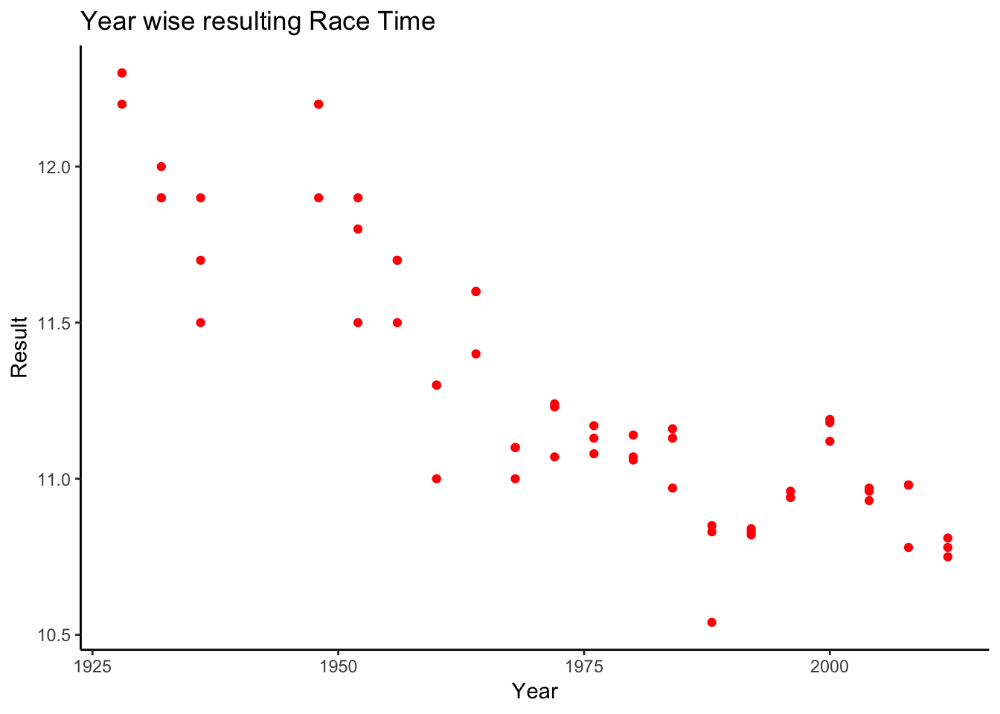
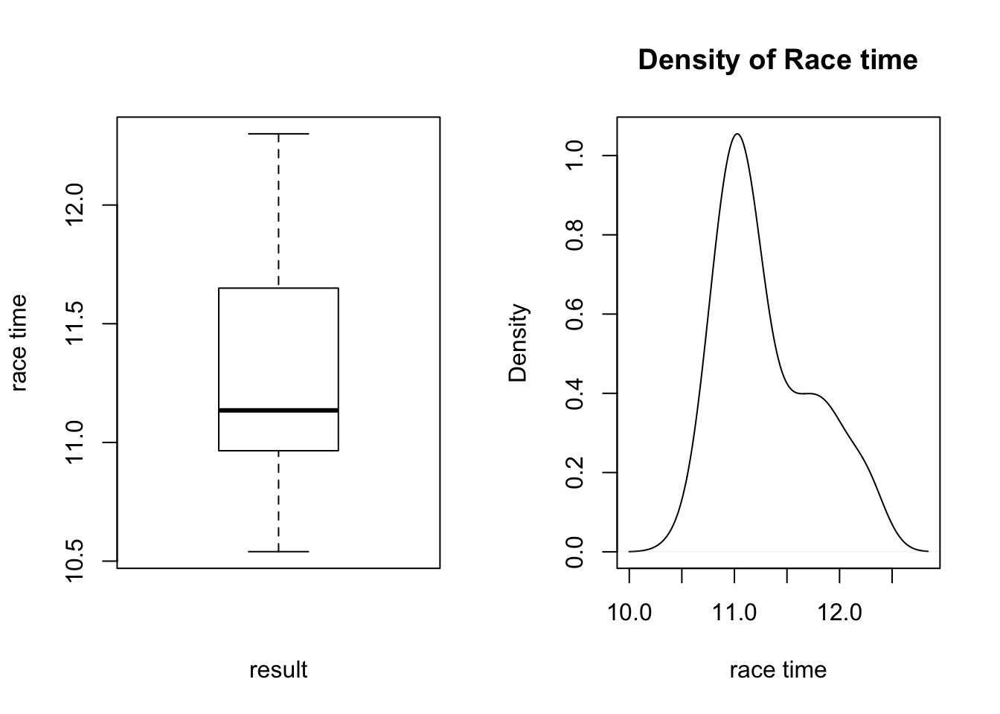
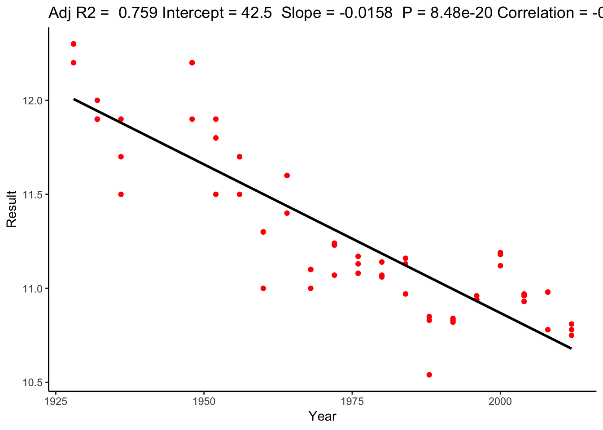
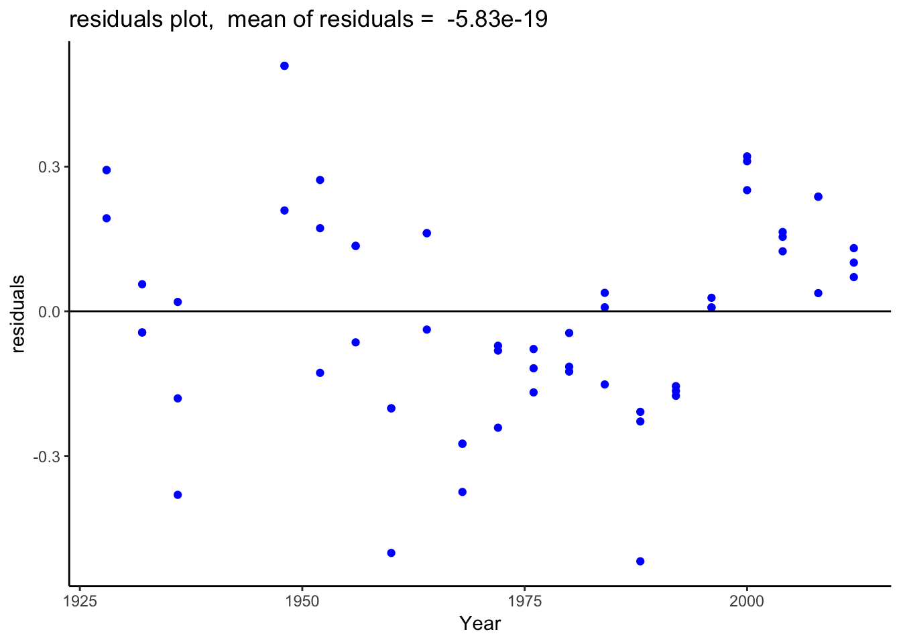
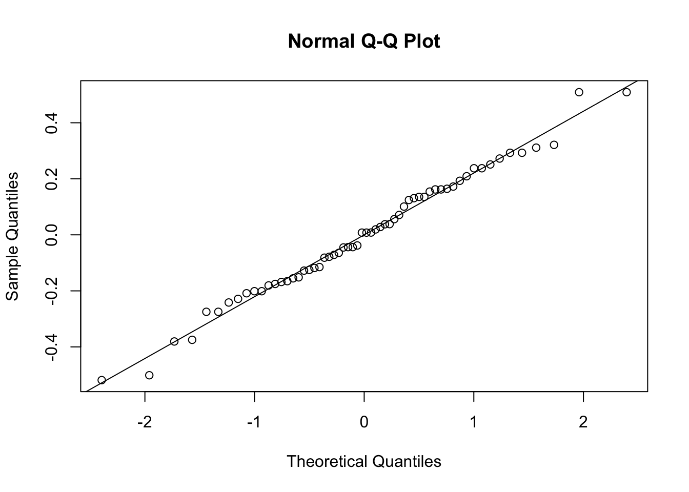

```r
library(ggplot2)
```

# Simple Linear Regression 

## Female Olympic Athletes Data

### Dataset description
The dataset contains race times for the 100m sprint by female athletes from 1928 (Amsterdam) to 2012 (London).

```r
data_url='/Users/kiran/Documents/mywork/portfolio/datascience/Simple Linear Regression/Olympics100mW.csv'
olympics=read.csv(data_url, header=TRUE)
```
Below are the columns of the dataset given by year, name of the athlete, medal won, country and resulting time achieved by the athelete.

```r
str(olympics)
## 'data.frame':	60 obs. of  5 variables:
##  $ Year   : int  1928 1928 1928 1932 1932 1932 1936 1936 1936 1948 ...
##  $ Athlete: Factor w/ 50 levels "Alice Brown",..: 12 17 13 44 24 47 23 44 30 16 ...
##  $ Medal  : Factor w/ 3 levels "BRONZE","GOLD",..: 2 3 1 2 3 1 2 3 1 2 ...
##  $ Country: Factor w/ 16 levels "AUS","BLR","CAN",..: 16 3 3 13 3 16 16 13 8 12 ...
##  $ Result : num  12.2 12.3 12.3 11.9 11.9 12 11.5 11.7 11.9 11.9 ...
```
The problem I am interested in answering is there a relation between Year of the race and the time record achieved by the athlete. In order to test this, a scatter plot between the two variables is made below
### Scatter plots

```r
ggplot(olympics) +geom_point(aes(Year, Result), color = 'red') +ggtitle('Year wise resulting Race Time') + theme_classic()
```


Since the scatter plot shows a trend of decreasing race times with every year, I further investigate the boxplot for identifying outliers and the desnity plot to check for normality of distributions.
### Boxplot & Density

```r
par(mfrow=c(1,2))
boxplot(olympics$Result, ylab = 'race time', xlab = 'result')
plot(density(olympics$Result), xlab = 'race time',main = 'Density of Race time')
```


Since the density ditribution shows an approximate normal distribution which is good enough for further analysis, a simple linear regression model is contructed below between race time and year.
### Fitting linear model

```r
mod = lm(Result ~ Year, data = olympics)
summary(mod)
## 
## Call:
## lm(formula = Result ~ Year, data = olympics)
## 
## Residuals:
##      Min       1Q   Median       3Q      Max 
## -0.51853 -0.15779  0.00795  0.16204  0.50909 
## 
## Coefficients:
##              Estimate Std. Error t value Pr(>|t|)    
## (Intercept) 42.487874   2.280955   18.63   <2e-16 ***
## Year        -0.015810   0.001156  -13.68   <2e-16 ***
## ---
## Signif. codes:  0 '***' 0.001 '**' 0.01 '*' 0.05 '.' 0.1 ' ' 1
## 
## Residual standard error: 0.2233 on 58 degrees of freedom
## Multiple R-squared:  0.7633,	Adjusted R-squared:  0.7592 
## F-statistic:   187 on 1 and 58 DF,  p-value: < 2.2e-16
```
The resulting linear regression or best fit line is given by - 

$Result = -0.016 Year + 42.49$

In order to test for the goodness of the fit, I plot the best fit line over the scatter plot. The $R^2$ value of ~ 0.76 tells us that around 76% of variation in y variable is captured by the x variable in our given model
### Fit Diagnostics

```r
ggplot(data = olympics, aes(x = Year, y = Result)) +geom_point(color = 'red') + geom_smooth(method = "lm", color = "black", se = FALSE) +ggtitle('Year wise resulting Race Time') +theme_classic() +
  labs(title = paste("Adj R2 = ",signif(summary(mod)$adj.r.squared, 3),
                     "Intercept =",signif(mod$coef[[1]],3 ),
                     " Slope =",signif(mod$coef[[2]], 3),
                     " P =",signif(summary(mod)$coef[2,4], 3),
                     "Correlation =", signif(cor(olympics$Result, olympics$Year),3)
))
```


The correlation coefficient of -0.87 provides a indicator of a strong negative relationship between the two variables. Another measure of best fit is to check for distribution of residuals. We want the residuals of the sum of square errors to have a symmetric distribution around the residual = 0 line such that the mean of residuals is very close to 0. 

```r
ggplot(data = olympics, aes(x = Year, y = mod$res)) + geom_point(color = 'blue') +geom_hline(yintercept = 0) + theme_classic() + labs(title = paste("residuals plot, ", "mean of residuals = ", signif(mean(mod$residuals) , 3) ))+ ylab('residuals')
```


The race times show no outliers and this can be further tested by checking for cooks distance of more than 1.

```r
if (round(cooks.distance(mod), 3)>1) print('True') else print('False')
## [1] "False"
```

Further a look at the Q-Q plot of our residuals proves that sample and theoretical distribution of residuals comes from the same distribution ie normal distribution. Hence we observe the approx straight line. It helps to check for homoscedasticity and normality assumptions of linear regression of residuals.

```r
q = qqnorm(mod$res)
abline(lm(y ~ x, data = q))
```



